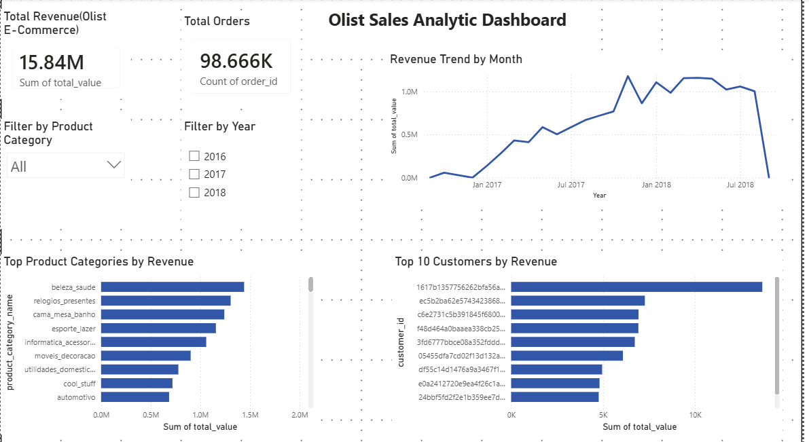

🚀 Sales & Inventory Analytics System (End-to-End Data Engineering Project)

📌 Project Overview

This project is a complete end-to-end Data Engineering pipeline built using real-world tools and workflows.

It transforms raw e-commerce data into a structured SQL Server data warehouse and an interactive Power BI dashboard using a fully automated Python ETL pipeline.

The project demonstrates how raw data is converted into business-ready insights using an industry-style architecture.

---

🧠 Key Capabilities

End-to-end ETL Pipeline (Python)

Data Warehousing (SQL Server)

Star Schema Data Modeling

Data Cleaning & Validation Layer

Automated Bulk Data Loading

Logging & Error Handling

Execution Time Monitoring

Business Intelligence Dashboard (Power BI)

---

📦 Dataset

Brazilian E-Commerce Public Dataset (Olist - Kaggle)

Includes:

Orders

Customers

Products

Order Items

Payments

Reviews

Sellers

---

🏗️ Architecture

Raw CSV Files
↓
Python ETL Pipeline
↓
Data Validation Layer
↓
SQL Server Data Warehouse
↓
Fact & Dimension Tables
↓
Power BI Reporting Layer
↓
Interactive Dashboard

---

⚙️ Tech Stack

Python (Pandas, PyODBC)

SQL Server (SSMS)

Power BI Desktop

Git & GitHub

VS Code

---

🔄 ETL Pipeline Workflow

Extract

Multi-table extraction (7 datasets from CSV)

Transform

Data cleaning and formatting

Date conversion

Null handling

Validate

Dataset integrity checks

Row count validation

Pipeline safety checks

Load

Bulk insert into SQL Server

Multi-table support

Performance optimized loading

Monitoring

Logging system (etl.log)

Error handling (try/except)

Execution time tracking

---

📊 Data Model (Star Schema)

Fact Table

fact_sales

Dimension Tables

dim_customer

dim_product

dim_seller

dim_date

dim_region

---

📈 Power BI Dashboard Features

Total Revenue KPI

Total Orders KPI

Monthly Revenue Trend

Top Product Categories

Top Customers Analysis

Region,Year & Category Filters

Interactive Drill-through Pages

---

🧠 Key Learnings

End-to-end ETL pipeline development

Data warehouse design (Star Schema)

SQL Server data modeling

Python automation for data engineering

Data validation and error handling

BI dashboard design in Power BI

📸 Dashboard Preview

Docs/dashboard_final.png

🚀 How to Run This Project

1. Clone Repository

git clone <your-repo-link>

2. Install Dependencies

pip install pandas pyodbc

3. Run ETL Pipeline

python main.py

4. Open Dashboard

Open Power BI .pbix file from the PowerBI/ folder

📌 Project Status

✔ Data ingestion completed
✔ SQL data warehouse built
✔ Python ETL pipeline automated
✔ Data validation & logging added
✔ Power BI dashboard completed
✔ Portfolio-ready project

👤 Author

Khadija Ashraf
Aspiring AI / Data Engineer

💡 Future Improvements

Cloud deployment (Azure / AWS)

Orchestrate pipeline using Airflow

Real-time data ingestion

AI-generated business insights

API layer for analytics access
